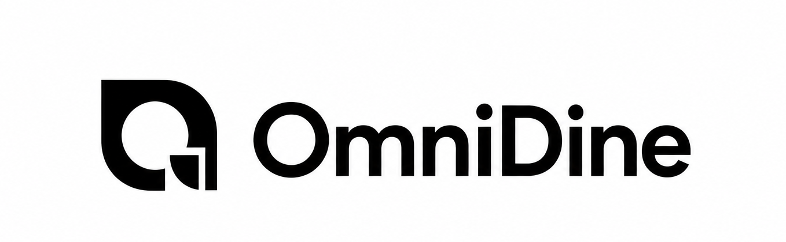
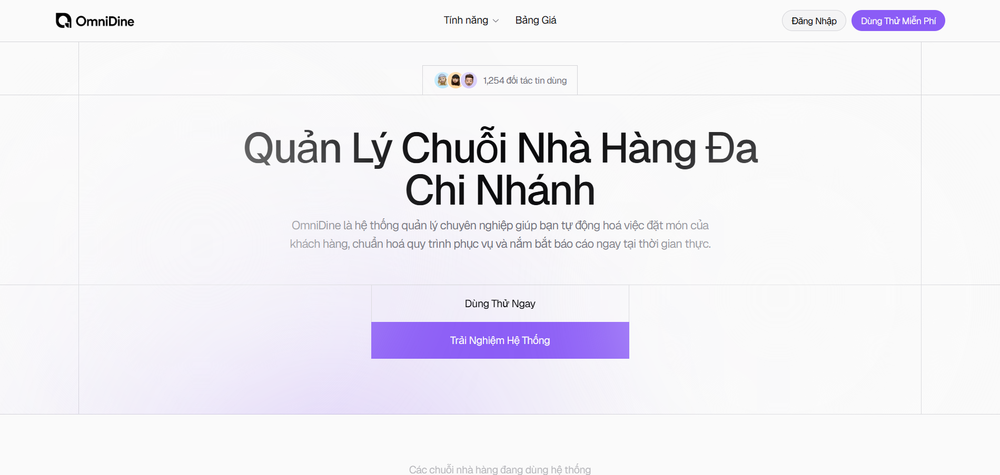
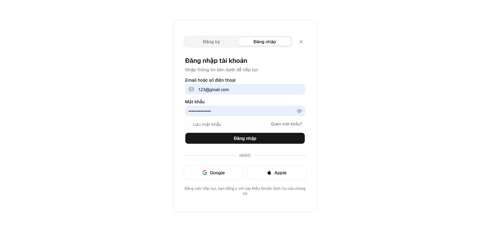
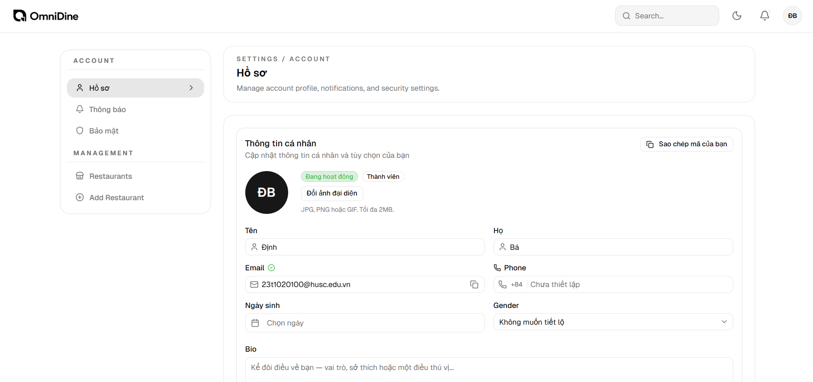
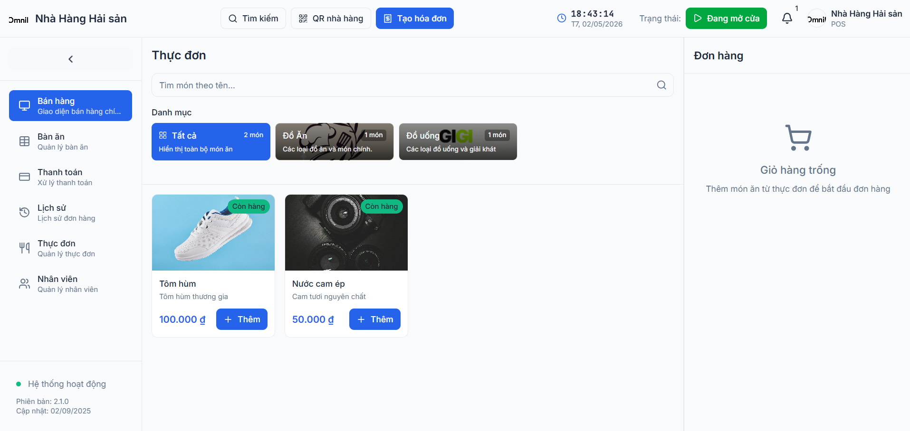
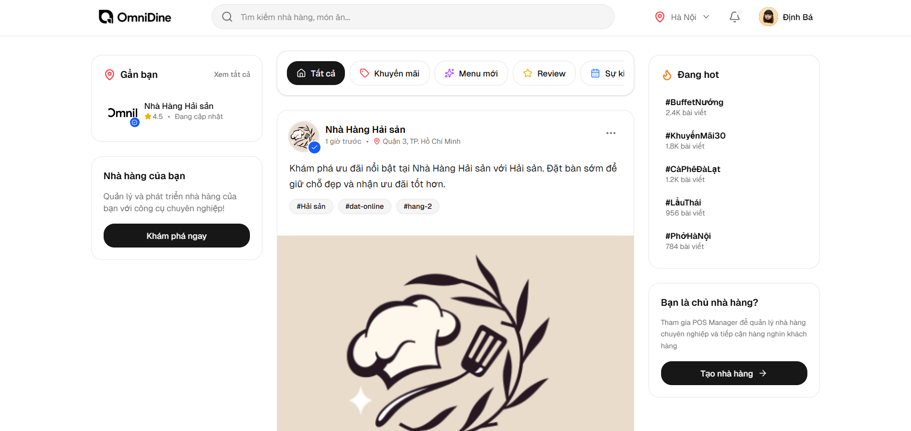
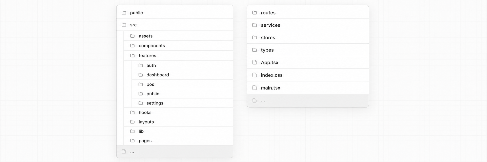

<div align="center">
  <p align="center">
    
  </p>
  <h1 align="center">OmniDine</h1>
  <p align="center">
    <strong>Hệ thống quản lý chuỗi nhà hàng toàn diện (Multi-Restaurant Management)</strong>
  </p>


  <p align="center">
    
    
    
    
    
  </p>

  <p align="center">
    <a href="#">
      
    </a>
  </p>

  <p align="center">
    <a href="#">Live Demo</a> •
    <a href="#">Báo lỗi (Issues)</a>
  </p>
</div>

<br />

## Preview
<div align="center">
  
  <br><br>
  <table>
    <tr>
      <td></td>
      <td></td>
    </tr>
    <tr>
      <td></td>
      <td></td>
    </tr>
  </table>
</div>

---

## Table of Contents
- [About / Overview](#about--overview)
- [Tech Stack](#tech-stack)
- [Getting Started](#getting-started)
  - [Prerequisites](#prerequisites)
  - [Installation](#installation)
  - [Running](#running)
- [Project Structure](#project-structure)
- [Scripts](#scripts)

---

## About / Overview

**OmniDine** ra đời nhằm giải quyết bài toán vận hành phức tạp của các chuỗi nhà hàng (F&B). Thay vì sử dụng nhiều phần mềm rời rạc cho từng khâu, hệ thống cung cấp một giải pháp "All-in-One" bao gồm từ POS (bán hàng tại quầy), quản lý thực đơn, đặt món công khai qua QR code cho đến Dashboard thống kê dành riêng cho quản lý/chủ doanh nghiệp.

Dự án được xây dựng với kiến trúc Frontend hiện đại, tối ưu hoá trải nghiệm người dùng (UX) và hiệu năng, tạo ra sự khác biệt thông qua giao diện sang trọng, thao tác mượt mà và khả năng mở rộng không giới hạn cho hệ thống nhiều chi nhánh.

### Key Features
- 🏬 **Multi-Branch Management**: Quản lý thông tin, nhân sự, và doanh thu của nhiều chi nhánh tập trung trên một nền tảng.
- 🛒 **Advanced POS System**: Giao diện máy bán hàng hiện đại (Point of Sale), xử lý đơn hàng nhanh chóng, hỗ trợ quản lý sơ đồ bàn (Table Management).
- 🍔 **Public Ordering**: Portal dành riêng cho khách hàng tự động đặt món qua mã QR (Dine-in) hoặc mua mang về (Takeaway).
- 📊 **Admin Dashboard**: Hệ thống báo cáo trực quan, quản lý danh mục, món ăn, và theo dõi hiệu suất hoạt động theo thời gian thực.
- 🛡️ **Role-based Auth**: Cơ chế phân quyền chi tiết (Admin, Manager, Staff) kết hợp xử lý JWT tự động (Refresh token interceptors).
- 🎨 **Modern & Responsive UI**: Thiết kế tối giản, thân thiện với thiết bị di động, sử dụng Tailwind CSS và các component chất lượng cao từ `shadcn/ui`.
- ⚡ **Optimized Performance**: SPA (Single Page Application) siêu tốc nhờ sức mạnh của React 19, Vite và quản lý trạng thái tinh gọn bằng Zustand.

---

## Tech Stack

| Layer | Technology | Description |
| :--- | :--- | :--- |
| **Framework** | [React 19](https://react.dev/) + [TypeScript](https://www.typescriptlang.org/) | Xây dựng UI linh hoạt, an toàn và dễ bảo trì |
| **Build Tool** | [Vite](https://vitejs.dev/) | Bundler tốc độ cao, hỗ trợ HMR siêu nhanh |
| **Styling** | [Tailwind CSS](https://tailwindcss.com/) + [shadcn/ui](https://ui.shadcn.com/) | Utility-first CSS và thư viện component tùy biến |
| **State Management** | [Zustand](https://zustand-demo.pmnd.rs/) | Quản lý global state (Auth, POS, User) nhỏ gọn |
| **Routing** | [React Router DOM](https://reactrouter.com/) | Xử lý điều hướng đa tầng (Nested routing) |
| **Networking** | [Axios](https://axios-http.com/) | HTTP Client với cơ chế Interceptors (Auth) |
| **Icons & Animation** | [Lucide](https://lucide.dev/) + [Framer Motion](https://www.framer.com/motion/) | Hệ thống icon sắc nét và hiệu ứng mượt mà |

---

## Getting Started

### Prerequisites
Để chạy dự án trên máy cá nhân, bạn cần cài đặt sẵn:
- **Node.js**: Phiên bản 18.x trở lên.
- **Package Manager**: Khuyến nghị sử dụng **pnpm** (như trong lockfile của dự án).

```bash
# Cài đặt pnpm (nếu chưa có)
npm install -g pnpm
```

### Installation

1. **Clone dự án về máy:**
   ```bash
   git clone https://github.com/dinhdev-nu/multi-restaurant-management.git
   cd multi-restaurant-management-ver2
   ```

2. **Cài đặt các gói phụ thuộc (Dependencies):**
   ```bash
   pnpm install
   ```

3. **Cấu hình biến môi trường:**
   - Tạo file `.env` ở thư mục gốc (hoặc copy từ `.env.example` nếu có).
   - Thiết lập các biến cấu hình cần thiết:
     ```env
     VITE_API_URL=http://localhost:3000/api  # Thay thế bằng URL Backend của bạn
     ```

### Running

Khởi động development server:
```bash
pnpm run dev
```
Truy cập `http://localhost:5173` (hoặc port hiển thị trên terminal) để xem ứng dụng.

---

## Project Structure

Cấu trúc dự án tuân theo mô hình Feature-based kết hợp với phân chia kĩ thuật để dễ dàng quản lý (Scale-friendly):

<p align="center">
    
  </p>
---

## Scripts

Dưới đây là các lệnh tiện ích được định nghĩa trong `package.json` sử dụng thường xuyên trong quá trình phát triển:

| Lệnh | Mô tả |
| :--- | :--- |
| `pnpm run dev` | Khởi động server ở chế độ phát triển (Hot-Module Replacement) |
| `pnpm run build` | Biên dịch TypeScript và đóng gói ứng dụng cho Production |
| `pnpm run preview` | Chạy thử bản build production ở local để kiểm tra |
| `pnpm run lint` | Chạy ESLint để phân tích, tìm lỗi code và đảm bảo code style |
| `pnpm run format` | Dùng Prettier để tự động định dạng chuẩn cho toàn bộ code |
| `pnpm run typecheck` | Kiểm tra lỗi kiểu tĩnh (TypeScript) mà không build ra file |
